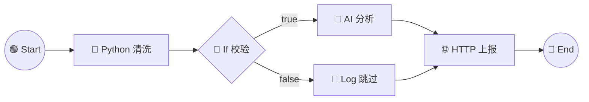

# dag-flow 工作流引擎架构设计 v3

> ⚠️ **历史文档（2026-09 早期设计阶段）**。现状已落地为：画布引擎 = **FlowGram
> free-layout**（@flowgram.ai/free-layout-editor，替换 reactflow v11，见
> `src/client/flowgram/`），存储 = **工作区 JSON 文件**（`<工作区>/.dag-flow-workflows/*.json`，
> SQLite 已退役，见 `src/adapter/storage.ts`）。本文的三项目对比与设计取舍仍有参考价值，
> 但具体技术选型以代码为准。

> 基于 dsh-node-flow / dsh-visual-workflow / dag-flow 三项目综合分析，
> 剔除缺陷、互补优点，形成一套优秀的 DAG 工作流设计交互架构。

---

## 1. 三项目优劣势综合

### 1.1 dsh-node-flow（@xyflow/react 12 + zustand）
**优点（采纳）**
- ✅ 双主题设计系统（`--wf-*` 变量，dark 默认 #08101e 深空蓝 + light 切换）
- ✅ `--kind` 类型色注入卡片背景光晕，10 节点统一色板
- ✅ 分支端口带标签（if:true/false、switch:case+default、loop:iterate/done）
- ✅ 运行状态=边框色 + 耗时 + 时刻徽标，选中 outline 分离不遮状态
- ✅ 前后端双镜像图遍历（visited + budget 10万防死循环 + stopAt 循环子遍历）
- ✅ 零依赖代码编辑器（textarea over highlighted pre）+ 全屏 modal
- ✅ 面向 AI 的内置 HelpDoc（精确 handle + 坑点清单）
- ✅ 定时任务存完整图快照 + 单定时器 cron
- ✅ lastRun 双向回填、运行路径高亮、失败策略/超时语义分离

**缺陷（剔除）**
- ❌ 定时任务/调度面板是独立弹层，与画布割裂
- ❌ 无自动布局（靠 fitView + 内置示例预排坐标）

### 1.2 dsh-visual-workflow（自研 SVG 画布 + React 19）
**优点（采纳）**
- ✅ DSH 官方 token 复用（`--dsw-alias-*` 深/浅自适应）——UI 与宿主原生统一
- ✅ 连线语义分色（flow/context/database/pass/fail/content 六色）
- ✅ 端口蓝进橙出（`--wf-port-in/out`），swapPorts 交换左右连接点美化布线
- ✅ 三通道 handle（db/ctx/flow 语义区分）
- ✅ 运行态虚线动画 + 状态点回显
- ✅ 协作组嵌套（组内成员迷你卡 + wf_ask_agent 阻塞通信）
- ✅ 双模式（编排执行 + API 服务）
- ✅ 断点续跑、双向同步（600ms 轮询防回环）
- ✅ 本地嵌入检索（bge-small-zh 三级降级）
- ✅ 提示词工程纪律（HEAD/MID/TAIL 三段）

**缺陷（剔除）**
- ❌ 自研 SVG 画布工作量大（~500 行），维护成本高——用 reactflow 成熟生态
- ❌ 依赖 @huggingface/transformers 重依赖，仅本地嵌入场景值得

### 1.3 dag-flow（当前，reactflow 11）
**优点（保留）**
- ✅ adapter 隔离架构 + safety.ts API drift 探测 + fail-soft
- ✅ 13 节点 + 5 视图（画布/缩略图/表单/JSON/AI 生成）
- ✅ 窗口化面板（最小化/最大化/拖拽/缓存）
- ✅ SQLite 存储（node:sqlite 零依赖）+ 运行记录落盘
- ✅ AI 模型配置 + 会话输入节点
- ✅ esbuild 双 bundle

**缺陷（修复）**
- ❌ ▶运行未接上（已修复：真实调用 run API + 回显）
- ❌ 样式不跟 DSH 主题（自建 --dsh-wf-*，本次方案一解决）
- ❌ 节点位置不持久化（DAG 布局字段解决）
- ❌ loop 占位无子图循环（DAG 语义解决）
- ❌ 无环路检测（DAG 拓扑校验解决）
- ❌ 参数编辑裸 JSON（schema 驱动表单解决）

---

## 2. DAG 有向无环图数据模型

### 2.1 核心类型

```ts
/** 工作流 = DAG（有向无环图） */
interface WorkflowDef {
  name: string;                 // kebab-case 唯一标识
  version: number;
  description?: string;
  nodes: DAGNode[];             // 节点集
  edges: DAGEdge[];             // 边集（DAG 唯一连接表示，替代 node.next）
  layout?: Record<string, Position>; // 布局持久化 { [nodeId]: {x,y} }
  meta?: { createdAt: number; updatedAt: number; tags?: string[] };
}

/** DAG 节点：单一职责，显式类型 */
interface DAGNode {
  id: string;                   // uuid
  type: NodeKind;               // start/end/python/bash/subagent/session_input/http/if/switch/set_var/log/manual/group
  label?: string;
  params: Record<string, JsonValue>; // 类型化参数（由 schema 驱动）
  groupId?: string;             // 所属协作组（可选）
  position: { x: number; y: number }; // 持久化位置
}

/** DAG 边：带语义的定向连接 */
interface DAGEdge {
  id: string;
  source: string;               // 源节点 id
  target: string;               // 目标节点 id
  sourceHandle: 'out' | 'true' | 'false' | `case:${string}` | 'iterate' | 'done' | 'in' | 'back';
  targetHandle: 'in' | string;
  label?: string;               // 边标签（如条件说明）
  kind?: 'flow' | 'context' | 'data' | 'pass' | 'fail'; // 语义分色
}
```

### 2.2 DAG 不变式（校验器保证）
1. **有向无环**：拓扑排序必须成功；连边形成环 → 拒绝并高亮环路径
2. **单起点**：恰好 1 个 start 节点（无入边）
3. **可达性**：每个节点至少有一条从 start 可达的路径；不可达 → 警告（灰色）
4. **端语义**：end 节点无出边；if/switch 的 condition 必须有 true/false 出口
5. **无并行歧义**：节点出边允许多条（并行 fan-out），入边 >1 需显式 join（默认合并最新值）

### 2.3 执行器（DAG 拓扑序）

```ts
async function runDAG(def: WorkflowDef, opts: RunOptions): Promise<RunSummary> {
  // 1. 校验：DAG 不变式 + 节点 schema
  const { sorted, cycles } = topoSort(def);       // Kahn 算法
  if (cycles.length) throw new DAGCycleError(cycles);
  // 2. 初始化上下文（inputs/vars/results）
  // 3. 按拓扑序执行（支持并行层 fan-out）
  for (const layer of sortedLayers) {
    await Promise.all(layer.map((id) => executeNode(id)));
  }
  // 4. onNodeDone 回调驱动 UI 高亮
  // 5. 落盘运行记录（SQLite runs 表）
}
```

**执行语义**：
- **串行层**：拓扑序同一层无依赖的节点可并行（`Promise.all`）
- **条件分支**：if/switch 输出 `{true,false}` / `{case}` 语义边，仅激活匹配分支
- **循环**：`loop` 节点包裹子图（DAG 内嵌子 DAG，非全局环）——子图独立拓扑，外层迭代 N 次
- **失败策略**：节点 onError ∈ stop / continue / goto；stop 记 firstError 终止
- **预算防护**：总节点执行上限（如 10 万步）+ 每节点超时（默认 30s）+ 循环 maxIterations

---

## 3. 双主题 UI 体系

用户核心需求：**一种跟随 DSH 风格，一种独立现代 node-flow 风格，可切换**。

### 3.1 架构：主题 token 抽象层

```ts
// theme.ts — 主题 token 归一化
export interface ThemeTokens {
  bg: string; panel: string; panel2: string;
  border: string; border2: string;
  text: string; text2: string; muted: string;
  accent: string; accentHover: string; onAccent: string;
  success: string; danger: string; warn: string;
  nodeBorder: string; nodeBorder2: string;
  edgeFlow: string; edgeContext: string; edgeData: string;
  edgePass: string; edgeFail: string;
  portIn: string; portOut: string;
  shadow: string; shadowLg: string;
  radius: number; font: string;
}

export const DSH_THEME: ThemeTokens = { /* 映射自 --dsw-alias-*，跟随宿主 */ };
export const NODE_FLOW_THEME: ThemeTokens = { /* 独立现代深空蓝，--nf-* */ };
```

**实现方式**：两种主题都归一化为 `ThemeTokens`，组件只消费 token（`const t = useTheme()`），切换=替换 token 对象 + 更新 `<html data-wf-theme="dsh|nodeflow">`。**不写两套 CSS**，一套语义化 CSS + token 注入。

### 3.2 主题 A：DSH 跟随风格
- 消费 `var(--dsw-alias-*)`（宿主深浅色自适应）
- 组件语言复用 DSH 官方 primitives
- 默认跟随宿主主题开关，无需用户单独配

### 3.3 主题 B：Node-Flow 现代风格（独立）
- 深空蓝基调：bg `#0b1120` / panel `#101a2b` / panel2 `#162135`
- 节点 `--kind` 类型色注入背景光晕
- 圆角 10/12/15/16px + backdrop-blur + color-mix 半透明
- 卡片 hover 浮起（translateY + 阴影增强）
- 现代渐变主按钮（linear-gradient accent→dark）

### 3.4 切换入口
- 设置页「外观」分区：主题下拉（跟随 DSH / Node-Flow 深色 / Node-Flow 浅色 / 自动）
- 持久化到 localStorage `wf-theme` + 可选同步到 ~/.dsh/workflows/settings.json

---

## 4. 完整交互逻辑设计

### 4.1 画布操作
| 操作 | 交互 |
|---|---|
| 拖入节点 | 左侧 palette 拖拽 → 画布落点放置（吸附网格 8px） |
| 连线 | 节点端口拖出 → 目标端口（蓝进橙出；非法连接红 X 拒绝） |
| 双击节点 | 打开右侧 Inspector（schema 驱动表单） |
| 单击节点/边 | 选中（outline 光圈，不遮状态色） |
| 拖拽移动 | 节点拖动；多选后整体拖动 |
| Delete/Backspace | 删除选中（输入框聚焦时不触发） |
| 撤销/重做 | Ctrl+Z / Ctrl+Shift+Z（zundo 状态历史） |
| 复制/粘贴 | Ctrl+C/Ctrl+V（含节点参数） |
| 缩放/平移 | 滚轮缩放、空白拖拽平移、MiniMap 导航 |
| 自动布局 | 工具栏「整理」按钮 → dagre 分层布局 |
| 边标签编辑 | 双击边 → 编辑标签/条件说明 |

### 4.2 运行反馈
- **运行态**：节点边框琥珀光晕 + 边虚线流动动画
- **成功/失败**：节点状态点（绿/红）+ 左上耗时 + 右下时刻
- **实际路径高亮**：activeEdgeIds 驱动边 glow（`#35d39a` + drop-shadow）
- **运行记录**：底部/侧栏「运行历史」面板，选记录可回填画布节点状态
- **断点续跑**（高级）：记录已成功节点，从失败点 resume

### 4.3 节点编辑
- **schema 驱动表单**：每个节点定义 JSON Schema → 自动生成表单（输入框/下拉/代码编辑器）
- **参数实时受控**：输入即生效（非 onBlur）
- **代码节点**：内联代码编辑器（monaco，主题跟随）+ 全屏 modal
- **协作组**（高级）：group 节点内嵌成员，组内并行 + wf_ask_agent

### 4.4 保存/加载/管理
- **自动缓存**：localStorage 防丢（关闭重开恢复）
- **保存**：💾 → SQLite workflows 表（name kebab + def JSON + updatedAt）
- **打开**：📂 下拉列出已保存工作流 → 加载画布
- **导入/导出**：.workflow.json 文件（v2 bundle 格式，含 layout+meta）

### 4.5 快捷键汇总
| 键 | 功能 |
|---|---|
| Ctrl+Z / Ctrl+Shift+Z | 撤销 / 重做 |
| Ctrl+C / Ctrl+V | 复制 / 粘贴 |
| Delete / Backspace | 删除选中 |
| Ctrl+D | 复制选中到下方 |
| Ctrl+Enter | 运行工作流 |
| Space | 临时抓手（平移） |
| Ctrl+= / Ctrl+- | 放大 / 缩小 |
| F | 适配画布 |

---

## 5. 落地路线（对当前 dag-flow）

### P0（本次目标）
1. **DAG 数据模型重构**：types.ts 改为 DAGNode/DAGEdge（layout 持久化、边语义）
2. **topoSort + 环路检测**：executor 改拓扑序执行 + Kahn 判环
3. **双主题 token 体系**：theme.ts 归一化 + DSH_THEME/NODE_FLOW_THEME + 切换
4. **节点位置持久化**：def.layout 读写，toRF 优先用持久化位置

### P1
5. **schema 驱动表单**：NodeInspector 改从节点 schema 生成
6. **运行状态可视化**：状态点 + 耗时 + 时刻徽标 + 路径高亮强化
7. **运行历史面板**：接 SQLite runs 表，选记录回填

### P2
8. **撤销/重做 + 快捷键**
9. **自动布局（dagre）+ MiniMap**
10. **协作组 + 断点续跑**

---

## 6. 可视化 DAG 示例



**语义**：Start → Python 清洗 → If 分支（true→AI 分析 / false→Log）→ 合流 HTTP 上报 → End。
这是典型 DAG：无环、单起点、条件分支、并行合流。
